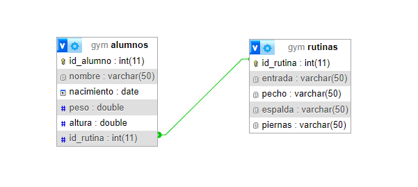

# WEB II
Trabajo Práctico Especial

## Integrantes
|DNI           |Apellido       |Nombre       |
|:-------------|:-------------|:-------------|
|18.038.228    |Garay         |Alejandro     |

## Tema
*GYM*  
- Cada Alumno de un Gimnasio podrá acceder a ver su Rutina de ejercicios.  
- Los Alumnos podrán ingresar con su Usuario y Contraseña, pudiendo así acceder a ver su Rutina de ejercicios.  
- El Profesor (Administrador) será quien diseñe las Rutinas, y se las asignará a cada Alumno.  
- Una misma Rutina puede ser asignada a varios Alumnos. Pero un Alumno solo puede ejercitar una Rutina.

## Relación 1 a N

<!-- Fecha de entrega primera parte: 16/09/24 -->  
<!-- Fecha de entrega primera parte: 19/10/24 -->  
